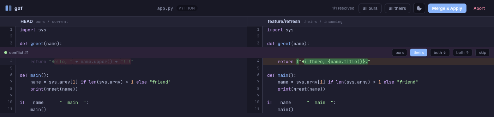
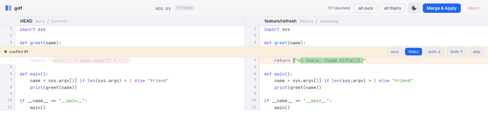

# gdf

[](https://github.com/mbarlow/gdf/actions/workflows/test.yml)
[](https://github.com/mbarlow/gdf/releases/latest)

[](LICENSE)

A meld-flavored side-by-side diff and merge tool that renders in a Chrome app
window. Vanilla JS/CSS/SVG, no build step. The Go binary is the long-running
process: it serves the UI, and when you resolve a merge it writes the result
back and exits — so it drops straight into `git mergetool`.

Resolving a conflict (`theirs` chosen — the un-kept side dims, intra-line change highlighted):




## What it does

- **Merge mode** — reads a git-conflicted file, parses `<<<<<<< ======= >>>>>>>`
  markers (2-way and diff3), shows ours/theirs side by side. Pick per conflict:
  **ours / theirs / both↓ / both↑ / base / skip**, hit **Merge & Apply**. The
  binary reassembles the file, writes it, exits 0.
- **Diff mode** — side-by-side diff of two files.
- Branch + filename labels in the headers, dual line-number gutters.
- Colorized diff with **intra-line** char highlighting (the changed substring
  inside a line, meld-style) via Myers diff.
- Syntax highlighting (highlight.js), light / dark theme (auto-detects, toggle).
- Fonts: Inter (UI), JetBrains Mono / SUSE Mono (code).

## Why

A diff tool shouldn't drag in a supply chain.

- **No npm, no Python, no `node_modules`.** Vanilla JS in the browser, a Go
  binary on the host. Nothing installs at runtime.
- **One dependency.** `sergi/go-diff`, pinned by hash in `go.sum`. That's the
  whole tree.
- **Supply-chain surface ≈ zero.** The recent npm attacks ride deep dependency
  trees and malicious postinstall scripts. gdf has neither. Nothing to poison.
- **Single static binary.** No runtime, no interpreter. Build once, run
  anywhere — linux / mac / windows, amd64 / arm64.
- **Reproducible.** Same source, same `go.sum`, same bytes.
- **A webview buys a rich UI for free.** Real layout, web fonts, color, SVG,
  motion — all in vanilla HTML/CSS/JS. No native-widget ceiling. The look is
  fully yours to shape; customization is endless.
- **And I love Go.**

## Install

Three ways. Pick one.

### Download a binary

Grab the archive for your platform from the [latest release][rel], verify, run:

```bash
# example: linux/amd64
tar -xzf gdf_v1.0.0_linux_amd64.tar.gz
install -Dm755 gdf ~/.local/bin/gdf

# verify against the published checksums
sha256sum -c checksums.txt --ignore-missing
```

Windows ships a `.zip`; macOS uses the `darwin` archives. Each release carries
`checksums.txt` (sha256) covering every asset.

The macOS binaries are unsigned, so Gatekeeper quarantines them on first run.
Clear it once:

```bash
xattr -d com.apple.quarantine gdf    # or: right-click -> Open
```

[rel]: https://github.com/mbarlow/gdf/releases/latest

### go install

```bash
go install github.com/mbarlow/gdf@latest    # -> $(go env GOPATH)/bin/gdf
```

`go install` replaced `go get` for installing binaries (Go 1.17+). While the
repo is **private**, set `GOPRIVATE` and have git use SSH:

```bash
export GOPRIVATE=github.com/mbarlow/*
git config --global url."git@github.com:".insteadOf "https://github.com/"
```

`@latest` resolves to the newest semver tag.

### Build from source

```bash
make install          # -> ~/.local/bin/gdf  (stamps version from git describe)
```

Requires Go 1.25+. At runtime gdf needs a Chromium-family browser on PATH
(google-chrome, chromium, brave, edge). `gdf --version` prints the build.

```bash
make install          # -> ~/.local/bin/gdf
```

Requires Go 1.25+ and a Chromium-family browser on PATH (google-chrome,
chromium, brave, edge).

## Usage

```bash
gdf merge <conflicted-file>     # resolve conflict markers, write back
gdf diff  <fileA> <fileB>       # side-by-side diff
gdf <fileA> <fileB>             # alias for diff

# flags (anywhere on the line):
#   --theme light|dark|auto    default auto
#   --port  N                  fixed port (default random)
#   --no-open                  print URL instead of launching Chrome
#   --lang  <id>               force syntax language (paths without an extension)
#   --version                  print version and exit
```

### As a git mergetool

```bash
make git-config
# or manually:
git config --global mergetool.gdf.cmd 'gdf merge "$MERGED"'
git config --global mergetool.gdf.trustExitCode true
git config --global merge.tool gdf      # <- without this, bare `git mergetool`
                                        #    falls back to git's built-in list

git mergetool            # uses gdf; or force per-run with: git mergetool -t gdf
```

`git mergetool` launches gdf **once per conflicted file, sequentially** — resolve
and close each window before the next opens.

Exit codes: `0` = merged/applied (or diff closed), `1` = aborted (Abort button,
window closed, or Esc). With `trustExitCode true`, git only marks a path
resolved when gdf exits 0.

### Diffing across branches / refs

Diff mode takes any two files, so pair it with `git show` and process
substitution to compare a path across branches, commits, or working tree:

```bash
# same file on two branches (--lang because /dev/fd/* has no extension)
gdf diff --lang python <(git show main:app.py) <(git show feature/refresh:app.py)

# working tree vs HEAD (right side is a real path, so it picks up .py itself)
gdf diff <(git show HEAD:app.py) app.py --lang python

# any two commits
gdf diff --lang json <(git show abc123:config.json) <(git show def456:config.json)
```

Process substitution (`<(...)`) feeds gdf opaque `/dev/fd/*` paths, so the pane
headers show those and syntax highlighting can't infer the language — pass
`--lang` to force it.

### Keys

- `Ctrl/Cmd+Enter` — Merge & Apply (when all conflicts resolved)
- `Esc` — Abort

## How it works

```
git mergetool ──► gdf merge $MERGED ──► HTTP server on 127.0.0.1:rand
                                          │
                          Chrome --app ◄──┘  (frameless app window)
                                          │
   you pick choices ──► POST /api/resolve ─► reassemble ─► write $MERGED ─► exit 0
```

The conflicted file is the source of truth: gdf splits it into literal segments
and conflict regions, renders the regions, and on resolve stitches the literal
text back together with your chosen blocks. No reliance on separate
LOCAL/BASE/REMOTE temp files — branch labels come from the markers themselves.

## License

[MIT](LICENSE). The one dependency, [sergi/go-diff](https://github.com/sergi/go-diff), is MIT too.
